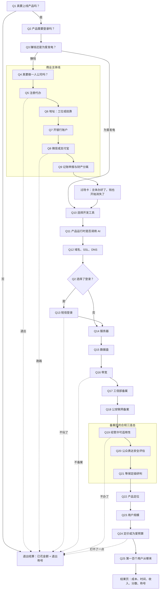

# 《一人公司生存模拟器》题库、流程与结算机制 v1（已废弃）

> **废弃声明（2026-07-16）：** 本文档仅保留为历史草稿，不再作为题库、路由、费用、分值或视觉实现依据。当前权威题库为 `content/quiz-v2.json`，原文来源与结构补全边界见 `design/quiz-source-map-v2.md`。

> 状态：产品设计已确认，等待同步到运行时题库与像素视觉。
>
> 确认日期：2026-07-16
>
> 视觉基线：Codex 任务 `019f68ec-aa14-7260-9fdc-cc616389963f` 中完成的人物母版、动作族、13 组四镜头分镜与 `/pixel/` 运行时。

## 1. 文档用途

本文件保存已确认的下一版题库结构、条件路由、费用与时间账本、100 分制和称号机制。它是后续改造 `content/challenges.json`、游戏核心状态机、Web 像素版和微信小程序时的产品依据。

这份历史稿撰写时运行时仍使用 `content/challenges.json`；当前运行时已切换到 `content/quiz-v2.json`，下文的旧口径不要继续实现。

本版只新增或重写已确认的内容：

- 开户后的记账、申报和公私财产分离；
- 开发工具订阅与产品运行时 AI 成本分离；
- 经营许可适用性、安全评估、等保定级研判三道顺承关卡；
- 产品定位、用户规模、定价与获客四道商业收尾题；
- 分离已支付、首年承诺、续费、变动成本、待报价、资本门槛、创始人工时和等待时间；
- 100 分能力分、退出称号和路线徽章。

本轮不新增独立的“数据特征钩子题”和“需求验证题”。

## 2. 总体结构

- 最大题数：25 题。
- 通常经历：18～25 题。
- Q3 选择为爱发电：跳过 Q4～Q9 的商业主体线。
- Q13 仅在 Q2 选择登录时出现。
- Q19、Q20、Q21 为连续三关，所有路线都会看到；不适用时记录判断理由，而不是直接隐藏。
- 旧版第 9 题“资质关卡完成”改为过场卡，不占题号。
- 任意“跑路/不玩了”选项进入退出结算；已支付费用不得回退。



## 3. 题库总表

分值缩写：`执`为执行力，`规`为合规判断，`商`为商业闭环。下表原始权重合计 85 分，另外 15 分由成本健康度动态计算。

### 3.1 出发与公司

| 题 | 题目与路线 | 现金变化 | 游戏时间 | 权重 |
|---|---|---:|---:|---:|
| Q1 | 真要 Vibe Coding 上线产品吗？是进入 Q2；不是结束 | ¥0 | 0.25～1h | 执1 |
| Q2 | 产品要登录吗？记录登录标记，两项都进入 Q3 | ¥0 | 0.5～2h | 商2 |
| Q3 | 赚钱进入 Q4；为爱发电跳到 Q10 | ¥0 | 1～4h | 商3 |
| Q4 | 真要做一人公司吗？创业进入 Q5；不敢则结束 | ¥0 | 1～3h | 执2+规2 |
| Q5 | 找代办 ¥500；去吃饭则结束 | 一次性 ¥500 | 2～8h；约1～2天 | 执3 |
| Q6 | 工位 ¥18,000/年；挂靠 ¥2,000/年；退出 | 首年及续费 | 2～8h；1～7天 | 执2 |
| Q7 | 开公户，按 ¥500/年；退出 | ¥500/年 | 3～8h；3～15工作日 | 执2+规1 |
| Q8 | 微信、支付宝、全都要或跑路 | 固定项与交易费分开记录 | 3～10h；1～7工作日 | 执2+规2 |
| Q9 | 代理记账、自己做或去买球鞋 | ¥0 或 ¥2,000/年 | 1～4h；持续工时另计 | 执2+规4 |

### 3.2 开发、基础设施与备案

| 题 | 题目与路线 | 现金变化 | 游戏时间 | 权重 |
|---|---|---:|---:|---:|
| Q10 | 选择开发工具；没钱改用免费工具，不直接结束 | 按套餐 | MVP 默认 80h | 执2 |
| Q11 | 产品运行时不用 AI、调用模型或退出 | Token 等按量 | 4～20h；0～10天 | 执2+规3 |
| Q12 | 域名、SSL、DNS 按 ¥300/年；牛肉火锅则结束 | ¥300/年预算 | 1～4h；0～3天 | 执1 |
| Q13 | 短信登录 ¥45/1000条；改游客；退出 | 首包 ¥45，后续按量 | 4～12h；1～7工作日 | 执1+规2 |
| Q14 | 1核2G；2核4G ¥1,300/年；买衣服则结束 | ¥1,300/年或待定 | 3～12h；0～1天 | 执2 |
| Q15 | 40G+100G ¥600/年；只买40G ¥200/年 | ¥200～600/年 | 1～4h | 执1+规2 |
| Q16 | 固定3M带宽 ¥724.20/年；退出 | ¥724.20/年 | 0.5～2h | 执1 |
| Q17 | 提交工信部备案；放弃 | 自办直接费记 ¥0 | 3～8h；5～20工作日 | 执3+规2 |
| Q18 | 上线后办理公安联网备案；放弃 | 自办直接费记 ¥0 | 2～6h；办理期另记 | 执2+规2 |

### 3.3 合规三连击与商业闭环

| 题 | 题目与路线 | 现金变化 | 游戏时间 | 权重 |
|---|---|---:|---:|---:|
| Q19 | 判断第三方发布、入驻或撮合平台能力 | 注册资本单列；费用待确认 | 4～16h；申办可达20～60工作日 | 规3 |
| Q20 | 无公众表达、自己评估、第三方报价或退出 | ¥0 或待支付 ¥12,000 | 2～40h；5～30工作日 | 规2 |
| Q21 | 先定级研判、二级压力预算、三级压力预算或退出 | 全部先记待确认 | 4～20h；整改另计 | 规2 |
| Q22 | 定位清楚、大厂风险、没想好或判断无价值 | 调研成本可选 | 4～24h；2～7天 | 商8 |
| Q23 | 100、1000、1万、10万用户 | ¥0 | 0.5～1h | 商5 |
| Q24 | ¥9.9、¥19.9、¥29.9 或打不了一点 | 用于计算收入 | 1～2h | 商6 |
| Q25 | 内容社群、买量或直接上线 | 工时或营销预算 | 2～60h | 执1+商6 |

## 4. 新增与重写题目文案

### Q9 记账、申报与财产分离

题目：

> 总裁，公司开好了。就算还没赚钱，也要记账、申报和维护公私财产分离，不然可能影响到家庭和个人财产噢！！

选项：

1. `找代理记账，按 ¥2,000/年。`
   - 首年固定成本 +¥2,000；次年续费 +¥2,000。
   - 初始协调 1～4h；后续约 0.5～2h/月。
2. `我自己来，现金一分不花，时间全部献祭。`
   - 现金 ¥0；记录约 2～6h/月持续工时。
3. `呜呜呜，不玩了，我去买球鞋。`
   - 结束。

### Q10 开发工具

连续包年或年化口径：

- GLM Lite：¥470.40/年。
- GLM Pro：¥1,430.40/年。
- GLM Max：¥4,502.40/年。
- ChatGPT Pro 高档：$200/月；结果页显示年化 $2,400，不伪装成包年。
- Kimi Allegretto：年付 $372；外币单独显示，不锁死人民币汇率。
- 免费工具：现金 ¥0，时间成本增加。

模型档位不决定得分高低。MVP 开发统一使用 80h 游戏默认值，避免虚构不同模型的确定开发效率。

### Q11 产品运行时 AI

题目：

> 写代码的 AI 已经有了；现在用户每点一下你的产品，要不要真的调用模型？

选项：

1. `不用 AI，普通 SaaS 也能活。`
   - 跳过运行时模型费用。
2. `必须用，没有 AI 我的产品就无了。`
   - 增加 Token 按量成本。
   - 增加“企业认证、对公充值、供应商合同或备案材料是否需要”的核实待办。
3. `拜拜了您咧。`
   - 结束。

开发工具订阅和产品 API 调用必须进入不同账本。企业认证、合同或授权按供应商和实际备案要求核实，不自动扣费。

### Q19 经营许可适用性

题目：

> 老师，备案都通过了，该判断经营许可了。除了你自己，别人能在网站里做什么？这决定那 100 万会不会来敲门。

选项按产品具备的最高能力互斥：

1. `只能买我的产品、看我的内容；不能发帖，也不能入驻。`
2. `用户可以发帖或投稿，但商家不能入驻卖货。`
3. `商家可以入驻、上架商品或者由平台撮合交易。100 万门槛我先研究。`
4. `拜拜了，100 块我都快没有了。`

如果最终确认需要省内增值电信业务许可：

- `capitalRequirements += ¥1,000,000`；
- 不计入已花现金；
- 官方申请费用记 ¥0；
- 中介、人员、社保与技术整改进入待报价；
- 许可办理等待进入关键路径。

### Q20 公众表达安全评估

题目：

> 办完证没结束。你的产品会不会让用户把内容公开给不特定的人看，或者形成社群传播？

选项：

1. `没有，登录只是进门，不是开麦。`
   - 记录当前未触发该类安全评估。
2. `有，我自己开展安全评估。`
   - 增加安全评估待办；约 12～40h。
3. `有，找第三方做，当前询价 ¥12,000。`
   - 增加待支付报价，不立即计入已花现金。
4. `妈妈，我不想开麦了！`
   - 结束。

不得把普通登录或支付本身当作安全评估触发条件；第三方 ¥12,000 是本局询价，不是官方统一价。

### Q21 等保定级研判

题目：

> 数据已经落盘，但二级三级不能靠“有没有支付”自动开奖。爸爸可能又要花钱了，你准备怎么办？

选项：

1. `先按实际系统做定级研判，费用待确认。`
2. `如果最终属于二级，先用 ¥50,000 做历史压力预算。`
3. `如果最终属于三级，先用 ¥100,000 做本局惊吓预算。`
4. `天呐撸，我只是想写个网站而已啊！`

后两个金额只进入压力预算，不进入已花现金。系统不得由“存数据”或“支付”自动推导保护等级。

### Q22 产品定位

题目：

> 恭喜，总裁终于可以思考产品本身了。你的产品的用户、场景、需求和竞争关系想明白了吗？

选项：

1. `明白，而且能写出用户、场景、问题和差异化。`
   - 商业权重满分；增加 4～8h确认工时。
2. `好像大厂分分钟就能吃掉。`
   - 增加差异化待办；约 8～16h。
3. `只顾着办资质，后面还没想好。`
   - 增加用户调研待办；约 16～24h、2～7天。
4. `呜呜呜，没价值，再见了。`
   - 结束并授予及时止损类称号。

### Q23 用户规模

- 付费路线题目：`恭喜你，用户真的喜欢你的产品。你预计稳定月付费用户会有多少？`
- 免费路线题目：`恭喜你，用户真的喜欢你的产品。你预计稳定月活用户会有多少？`
- 选项：100、1000、1万、10万。
- 四个数字同分，只用于情景计算与徽章；用户数越大不会加更多分。

### Q24 定价或为爱预算

付费路线：

> 那用户会花多少钱为你付费？你已经投入了 ¥X，每个用户每月准备收多少？

- ¥9.9/月。
- ¥19.9/月。
- ¥29.9/月。
- `我靠，打不了一点。` → 结束。

免费路线使用同一题位的变体：

- 售价 ¥0。
- 必须填写年度现金上限和每月工时上限。

价格档位本身同分；成本健康度根据收入覆盖率动态计算。

### Q25 获客与上线

题目：

> 产品终于上线了，万事俱备。第一百个用户准备从哪里来？有钱买量，还是自己当 KOL？

选项：

1. `做内容、社群和口碑，用时间换流量。`
   - 增加约 20～60h/月创始人工时。
2. `投广告，但先设置最高可承受获客成本。`
   - 增加营销预算；`获客费 = 付费用户数 × CAC`。
3. `就这样吧，我真的累了。一人公司和零人产品挺配的，今天正式上线。`
   - 进入结果页；获得“零人产品发布官”徽章；商业题仅得部分分。

## 5. 费用账本

不得继续使用一个可以随意加减的 `x 元`。至少维护以下字段：

```text
paidSunkCny            已经支付，退出不能回退
firstYearCommittedCny  首年确定支出
renewalCny             次年固定续费
variableCosts[]        Token、短信、支付手续费、流量、广告
pendingQuotes[]        安全评估、等保、许可证中介等
capitalRequirements[]  注册资本等资格门槛
foreignCurrency{}      美元等外币，不静默换算
founderHours           上线前一次性工时
recurringHours         每月记账、内容运营等持续工时
```

每笔成本还应携带：

- `sourceType`：用户报价、官方价、历史口径或待询价；
- `chargeTiming`：现在支付、上线前支付、按量发生；
- `refundable`：是否可取消；
- `priceDate`：价格核对日期；
- `reason`：由哪道题、哪个能力触发。

退出确认统一显示：

> 现在停，不会再产生新的承诺；但已经支付的 ¥X 不会穿越回来。确定结束吗？

参考低成本商业路线：

```text
注册代办             ¥500
挂靠地址           ¥2,000
银行账户             ¥500
微信相关认证预算       ¥300
代理记账           ¥2,000
GLM Pro            ¥1,430.40
域名等               ¥300
短信首包              ¥45
服务器             ¥1,300
磁盘                 ¥600
带宽                 ¥724.20
--------------------------------
首年合计           ¥9,699.60
```

该示例不含运行时 AI、支付手续费、广告及三项待报价合规成本。若微信 ¥300 的具体认证环节实际不适用，首年合计为 ¥9,399.60。

## 6. 时间模型

必须分离：

- `founderHours`：创始人实际投入；
- `recurringHours`：每月持续投入；
- `blockingWait`：阻塞后续步骤的外部等待；
- `nonBlockingWait`：可以与开发或调研并行的等待；
- `postLaunchTasks`：上线后办理，不阻塞首发的事项。

单人默认每天最多投入 6 个有效工时。公司审核、备案等待期间可以继续开发、调研和生产内容。

```text
预计上线日 = max(
  公司与支付轨道完成日,
  产品开发与基础设施轨道完成日,
  工信部备案轨道完成日,
  命中的许可与安全轨道完成日,
  市场准备轨道完成日
)
```

公安联网备案作为上线后任务显示，不进入首发关键路径。

## 7. 100 分制

```text
执行力       30分
合规判断     25分
商业闭环     30分
成本健康度   15分
```

条件题不适用时，从该路线对应维度的分母中移除，不白送分，也不扣分：

```text
维度得分 = 维度上限 × 已得权重 ÷ 本路线适用权重
```

计分原则：

- 选择与真实产品匹配，并形成可执行结论：满分；
- 正确识别并留下明确待办：可得满分；
- 只有模糊的“以后再说”：一半；
- 错误因果或明知适用仍忽略：0 分；
- 花费更高不会获得额外分数；
- 同时接两个支付渠道不会获得额外分数；
- 高档模型不会获得额外分数；
- 第三方评估不会比自行评估分高；
- 10 万用户不会比 100 用户分高。

成本健康度计算：

```text
理论年流水 = 稳定月付费用户数 × 月价 × 12

首年覆盖率 =
理论年流水 ÷
(一次性成本 + 首年固定成本 + 已知年度变动成本)
```

- 覆盖率 ≥ 1.5：8 分；
- 覆盖率 ≥ 1.0：6 分；
- 覆盖率 0.7～0.99：4 分；
- 覆盖率 0～0.69：2 分；
- 无法计算：0 分；
- Token、短信、手续费和 CAC 都有上限：再加 4 分；
- 没有无用或重复采购：再加 3 分。

如果变动成本缺失，只能展示“理论流水”，不得展示“利润”。

免费路线不按收入处罚：

- 同时设置年度现金上限和每月工时上限：8 分；
- 只设置其中一项：5 分；
- 两项都没有：0 分。

## 8. 称号和徽章

只有走到结果页才授予主分数称号：

| 总分 | 主称号 |
|---:|---|
| 0～19 | 还在脑内公测 |
| 20～39 | Vibe Coding 练习生 |
| 40～59 | 上线求生者 |
| 60～69 | MVP 小老板 |
| 70～79 | 最小可行总裁 |
| 80～89 | 一人公司耐力王 |
| 90～100 | 真·一人公司经营者 |

中途退出优先使用退出称号：

- 没花钱退出：`清醒止损大师`；
- 已花不超过 ¥1,000：`及时刹车工程师`；
- 已花超过 ¥1,000：`沉没成本收藏家`；
- 合规三关后、市场题前退出：`证照齐了，用户没来`；
- Q22 判断产品无价值：`及时止损产品经理`；
- Q24 选择打不了一点：`清醒的撤退者`。

每局最多展示三个路线徽章，徽章不加分：

- `All in 工位王`：选择工位；
- `小孩子才做选择`：同时接微信和支付宝；
- `Token 黑洞领主`：运行时 AI 没有用量上限；
- `十万用户许愿池`：选择 10 万用户；
- `美图定价学研究员`：选择 ¥29.9；
- `创始人即流量`：内容、社群和口碑获客；
- `增长有刹车`：买量并设置 CAC；
- `模型供养人`：没有收入基础却购买最高档模型；
- `服务器纪念碑管理员`：已买服务器但没有获客计划；
- `安心包收藏家`：未经适用性判断直接购买评估服务；
- `资质收藏家`：资质支出很高但产品定位未想清；
- `零人产品发布官`：无获客计划直接上线。

主称号解析顺序：

1. 中途退出时，使用退出称号，不授予总分称号；
2. 完成全部适用题后，根据总分授予一个主称号；
3. 再根据路线追加最多三个徽章。

## 9. 结果页合同

结果页必须同时展示：

1. 主称号和最多三个徽章；
2. 执行力、合规判断、商业闭环、成本健康度；
3. 已支付、首年承诺、次年续费、变动成本；
4. 待报价项目和资本门槛；
5. 一次性创始人工时、每月持续工时、关键路径等待；
6. 预计最快上线日期和上线后待办；
7. 理论月流水、理论年流水；
8. 可计算时展示盈亏平衡付费用户数；
9. 尚未确定的变量和最重要的三个下一步待办。

若单用户月变动成本已知：

```text
盈亏平衡付费用户数 =
ceil(
  (一次性成本 + 首年固定成本)
  ÷ (12 × (月价 - 单用户月变动成本))
)
```

若变动成本未知，只展示不包含变动成本的理论下限，并明确标记“利润暂不可计算”。

## 10. 不可违反的口径

- 商业化不自动等于必须注册一人有限公司；本游戏当前商业路线仍沿用用户选定的一人公司叙事，但结果页要标记这是路线选择，不是普遍法律结论。
- 微信 ¥300 只能表示某个明确的平台认证预算，不得写成微信支付统一认证费。
- 支付宝固定认证费为 ¥0，不代表没有交易手续费和接入成本。
- 登录不自动等于短信登录。
- 登录或商业化不自动等于必须购买数据盘。
- 数据盘不等于备份与恢复方案。
- 工信部备案不得承诺固定 7 天。
- 公安联网备案不得写成固定 7 天出结果，并应作为上线后任务处理。
- 普通登录或支付不自动触发公众表达安全评估。
- 第三方安全评估不存在本游戏可宣称的官方统一 ¥12,000 价格。
- 存数据不自动等于等保二级，有支付不自动等于等保三级。
- 注册资本门槛不得直接计入已花现金。
- 已支付费用不得因为后续改变路线而倒扣。
- 游戏内容不替代法律、财税或安全专业意见。

## 11. 来源登记

- ChatGPT Pro 价格与计费方式：<https://help.openai.com/en/articles/9793128/>
- Kimi K2.7 Code 会员年付价格：<https://www.kimi.com/resources/kimi-k2-7-code>
- 增值电信业务经营许可常见问题：<https://jsca.miit.gov.cn/gzcy/gggs/art/2025/art_1d7aec0258754cfe90acf6f350c34894.html>
- 增值电信业务经营许可申请指南：<https://gdca.miit.gov.cn/bsfw/bszn/jyxk/tzgg/art/2025/art_9802f0eeae4647b5bc22a6af33ae0bf7.html>
- 具有舆论属性或社会动员能力的互联网信息服务安全评估规定：<https://www.cac.gov.cn/2019-03/20/c_1124259405.htm>
- GB/T 22240-2020 网络安全等级保护定级指南：<https://openstd.samr.gov.cn/bzgk/std/newGbInfo?hcno=63B89FFF7CC97EBBBED8A403396F0F00>
- 非经营性网站备案常见问题：<https://jxca.miit.gov.cn/bsfw/bszn/cjwt/art/2020/art_869445de6a9f40e98732195df440f99d.html>
- 公安联网备案办事说明参考：<https://www.caheb.gov.cn/system/2023/03/25/030218406.shtml>

## 12. 实现前验收条件

进入运行时实现后，完成标准为：

1. 25 题和条件跳转均能由结构化配置表达，不在 UI 中硬编码题号；
2. 免费路线、商业路线、登录路线和免登录路线均能完整到达结果页；
3. Q19～Q21 连续出现，且上游答案与下游“不适用”判断不能自相矛盾；
4. 已支付、首年承诺、续费、变动成本、待报价和资本门槛不会互相混算；
5. 退出后只取消未来承诺，不回退沉没成本；
6. 条件题不适用时按路线权重归一化，退出时不利用归一化获得高分；
7. 结果页能够复算理论年流水、成本覆盖率和称号；
8. Web 四套视觉入口和微信小程序使用同一题库与纯函数核心；
9. 像素版沿用已批准人物母版、动作锚点和四镜头场景合同；
10. 桌面、390×844 手机、键盘、减少动画、退出、围观和完整通关均通过真实浏览器验收。
