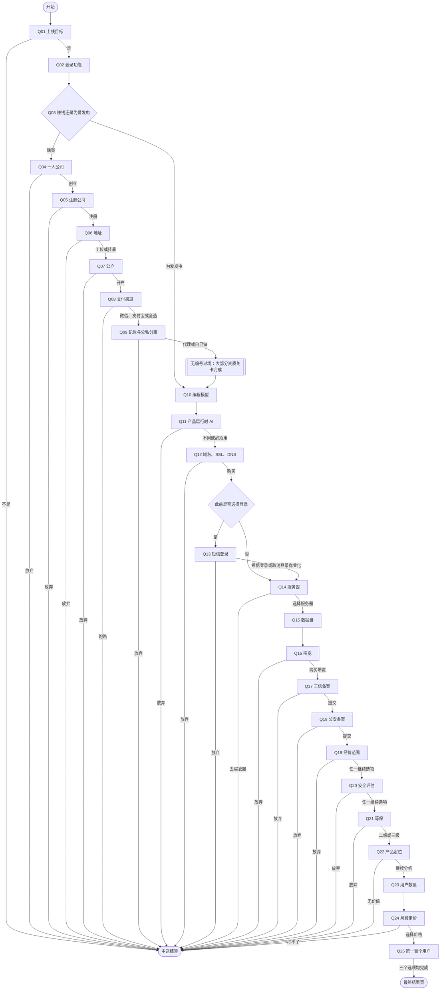
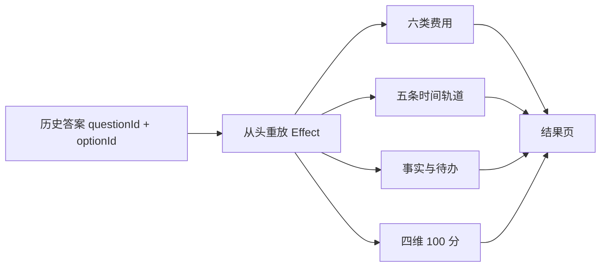

# Quiz v2：25 题运行流程

> 冻结日期：2026-07-16。运行时权威数据是 `content/quiz-v2.json`；本图用于人工审阅编号、条件题、跳题和结算边界。

## 运行时不变量

- `Q03 / 为爱发电` 只跳过 Q04～Q09，仍从 Q10 进入产品开发。
- Q13 只在 `requiresLogin === true` 时出现；跳过的条件题从该路线评分分母移除。
- Q19、Q20、Q21 对所有非退出路线严格顺承，不互斥、不跳过。
- 任一退出选项直接结算；已发生费用保留，不自动撤销。
- 返回上一题时删除最后一条 `{questionId, optionId}`，再从空状态重放历史，因此费用、时间、事实、分数和场景会一起回滚。
- Q25 三个选项都进入最终结果页；完成结果复用 Q25 的 `resolved` 场景帧。

## 结算数据流

