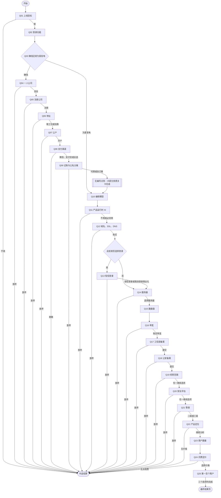
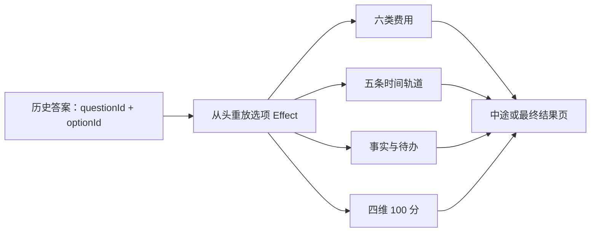

# 《一人公司生存模拟器》题目与流程

> 整理日期：2026-07-17
> 题库版本：`opc-survival-quiz-v2` / `2.0.0`
> 运行时权威数据：`content/quiz-v2.json`
> 本文用于集中审阅题目、选项、跳题、退出与结算流程，不替代运行时 JSON。

## 一、流程总览

### 关键流程规则

- Q03 选择“为爱发电”时，跳过 Q04～Q09，直接进入 Q10。
- Q09 完成后先进入无编号过场：“恭喜你，走完了大部分的资质关卡，可以开始做自己的产品了”。
- Q13 仅在 Q02 选择登录、即 `requiresLogin === true` 时出现；游客路线从 Q12 直接进入 Q14。
- Q19、Q20、Q21 的所有非退出选项均严格进入下一题，不互斥、不跳题。
- 任一退出选项都会直接进入中途结算；此前已经发生的费用、工时、等待与事实记录继续保留。
- Q25 的三个选项均进入最终结果页。

## 二、完整题目

### 第一章：真要上线吗

#### Q01｜上线目标

**题目**

你的目标是Vibe Coding上线一个产品吗

**选项**

1. `launch`：是的，AI现在超简单 → Q02
2. `not-launching`：不是 → 中途结算「本测评只面对独立开发者」

> 口径说明：本测评只面向准备上线产品的独立开发者。

#### Q02｜登录功能

**题目**

你的产品有登录功能吗？

**选项**

1. `login`：肯定要呀，不然咋增长黑客 → Q03，并记录需要登录
2. `guest`：不用的，来了直接就能用 → Q03，并记录无需登录

> 口径说明：选择登录会在 Q13 进入短信登录题；不登录则自动跳过 Q13。

#### Q03｜商业化选择

**题目**

你的产品想要为爱发电还是赚钱呢？

**选项**

1. `profit`：一个月200刀，我不赚钱谁赚钱？ → Q04
2. `love`：我的爱很大！！！ → 跳过 Q04～Q09，直接进入 Q10

> 口径说明：为爱发电路线只跳过公司主体与支付相关题目，仍继续进入产品开发流程。

#### Q04｜一人公司

**题目**

由于需要支付能力，所以需要开公司了，你真的要做一人公司吗？

**选项**

1. `found-company`：是的，我要创业 → Q05
2. `too-scared`：算了，我不敢 → 中途结算「创业门口观察员」

> 口径说明：设立公司的必要性与具体支付产品、经营方式及所在地要求有关。

### 第二章：一人公司入场券

#### Q05｜注册公司

**题目**

注册公司代办需要500块钱，1-2天时间，是否要注册？

**选项**

1. `register`：献祭1个月GPT Pro 5x → Q06
2. `eat-instead`：不要，我要去吃好吃的饭！ → 中途结算「牛肉火锅优先股东」

> 口径说明：¥500 与 1 至 2 天为本局用户提供口径，并非全国统一官方价格或承诺时限。

#### Q06｜注册地址

**题目**

注册公司需要选择租赁地址，请问你选择租赁还是挂靠

**选项**

1. `desk`：我要All in，租个工位（1500元/月，一年大概1.8万） → Q07
2. `hosted`：我还在打工呢，挂靠吧（2000一年） → Q07
3. `too-much`：算了算了，太麻烦了。 → 中途结算「地址沙盘逃生员」

> 口径说明：注册地址和实际经营场所要求应按所在地监管规则核实，挂靠并非在所有场景都适用。

#### Q07｜银行账户

**题目**

申请支付、收款，都需要开设银行账户，是否开户

**选项**

1. `open-bank-account`：必须的，我有梦想，一年500块，再献祭1个月GPT Pro 5x → Q08
2. `stop-before-bank`：还没赚钱，首年总投入已经到 `{{spent}}` 了吗？？？算了 → 中途结算「沉没成本观察员」

> 口径说明：具体支付产品是否要求对公账户及账户年费，应以银行与支付机构当前规则为准。

#### Q08｜支付渠道

**题目**

总裁，公户办好了，请问需要申请什么支付呢

**选项**

1. `wechat-pay`：微信支付，认证费300/年（折合 `{{optionMonthlyAverageInvestment}}`/月） → Q09
2. `alipay`：支付宝支付，没有认证费 → Q09
3. `both`：小孩子才做选择，我全都要（微信认证折合 `{{optionMonthlyAverageInvestment}}`/月） → Q09
4. `run-away`：小孩子选择跑路 → 中途结算「支付闸门逃生员」

> 口径说明：¥300 为本局微信相关认证预算口径；选择后计入首年总投入，并按 12 个月折算为月均投入；支付手续费与适用条件需按支付机构当前规则核实。

#### Q09｜记账与公私财产分离

**题目**

总裁，公司开好了。就算还没赚钱，也要记账、申报和维护公私财产分离，不然可能影响到家庭和个人财产噢！！

**选项**

1. `agency-bookkeeping`：找代理记账，按 ¥2,000/年。 → 无编号过场 → Q10
2. `self-bookkeeping`：我自己做。 → 无编号过场 → Q10
3. `buy-sneakers`：呜呜呜，不玩了，我去买球鞋。 → 中途结算「球鞋优先财务官」

> 口径说明：具体记账、纳税申报与财产责任边界应按企业类型、所在地和实际经营情况向专业人士核实。

### 第三章：代码与云端账单

#### Q10｜编程模型

**题目**

心心念念第一个产品，肯定要拉满啊，你选什么模型？

**选项**

1. `gpt-ultra`：GPT 5.6 Ultra-200刀/月 → Q11
2. `glm-pro`：GLM 5.2，¥149/月 → Q11
3. `kimi-code`：Kimi K3,大概是699元/月 → Q11
4. `free-tools`：我没有钱。。。。 → Q11

> 口径说明：GPT 的 200 美元/月按 2026-07-16 人民币汇率中间价 1 美元 = ¥6.7909 折算，约 ¥1,358.18/月、¥16,298.16/年，实际支付以账单汇率为准。GLM Coding Pro 按月付 ¥149/月计（首年约 ¥1,788，官方另有连续包年 8 折约 ¥1,430.4/年）；套餐价格应在购买时再次核对。开发工具订阅和产品运行时模型 API 成本分开记账。

#### Q11｜产品运行时 AI

**题目**

写代码的AI有了，你的产品功能涉及到AI吗？

**选项**

1. `no-runtime-ai`：不用AI → Q12
2. `runtime-ai`：必须用，没有AI我的产品无了。 → Q12，并记录按量成本与材料待办
3. `goodbye`：拜拜了您咧。 → 中途结算「Token 账单躲避者」

> 口径说明：模型 API 与内容审核均属于变动成本；若调用第三方模型，备案阶段需按实际要求核实供应商合同、授权或其他材料。

#### Q12｜域名、SSL 与 DNS

**题目**

产品开发的差不多了，要买域名和 ssl 和 dns 了

**选项**

1. `buy-domain-stack`：300 块小意思 → 登录路线进入 Q13，游客路线跳至 Q14
2. `hotpot`：我想要吃顿牛肉火锅 → 中途结算「域名换火锅体验官」

> 口径说明：¥300 为本局合并预算口径；域名、证书和 DNS 的实际价格与免费方案需分别核实。

#### Q13｜短信登录（条件题）

**出现条件**

Q02 选择登录，即 `requiresLogin === true`。

**题目**

前面你说要登录，最简单的方式是短信登录

**选项**

1. `sms-login`：45块1000条，好划算买买买 → Q14
2. `remove-login-and-commerce`：我改变主意了，不要登录也不商业化了 → Q14，并撤销尚未支付的微信相关预算
3. `quit`：不干了！！！ → 中途结算「验证码拒收用户」

> 口径说明：改为无登录且不商业化时，撤销 Q08 中尚未支付的微信相关认证预算、续费预算与按量手续费；已经支付的沉没成本不回退。

#### Q14｜服务器

**题目**

收不收钱都要有服务器，买什么规格的

**选项**

1. `one-core-two-gb`：1核2g，openclaw都跑不动，你确定要买？ → Q15
2. `two-core-four-gb`：2核4g，1300元/年 → Q15
3. `buy-clothes`：库里新t才300啊QAQ，我去买4件 → 中途结算「服务器换新衣买手」

> 口径说明：规格选择应按实际负载测试；题目中的价格只按用户给出的已知口径记录。

#### Q15｜数据盘

**题目**

既然要登录要商业化，要有数据盘

**选项**

1. `system-and-data-disk`：系统盘40g+数据盘100g-600元/年 → Q16
2. `system-disk-only`：不买，不存-200元 40g系统盘 → Q16

> 口径说明：是否需要独立数据盘取决于数据量、可靠性与备份策略；仅有系统盘不等于无需备份。

#### Q16｜带宽

**题目**

不买数据盘，带宽总要吧

**选项**

1. `three-megabit`：3兆/年，724.2元/年 → Q17
2. `quit-after-spending`：不玩了，但首年总投入已经到 `{{spent}}`，真的不玩？ → 中途结算「带宽闸门刹车手」

> 口径说明：¥724.2/年为本局 3M 带宽预算口径，实际价格与计费模式需按云厂商当前报价核实。

### 第四章：备案后的三连击

#### Q17｜工信部备案

**题目**

恭喜你走到这里，网站就差上线了，现在开始，轻易不花钱了，就是杀时间

**选项**

1. `submit-miit-filing`：提交网站备案，7天出结果 → Q18
2. `quit-at-filing`：都要上线了，还不搞吗？？？ → 中途结算「上线前一厘米撤退者」

> 口径说明：题目沿用 7 天游戏口径；工信部备案实际周期取决于接入商、材料和属地审核，不作为官方承诺。

#### Q18｜公安联网备案

**题目**

工信部备案通过了，美滋滋

**选项**

1. `submit-police-filing`：来都来了，提交公安备案，7天出结果 → Q19
2. `quit-at-police-filing`：我的天，妈妈我不想玩了！！！ → 中途结算「备案耐力耗尽者」

> 口径说明：题目沿用 7 天游戏口径；公安联网备案的适用范围、提交时间与实际周期应按属地要求核实。

#### Q19｜经营范围

**题目**

老师，备案都通过了，该办证了，你的网站经营范围是什么？这决定要不要花100万

**选项**

1. `self-operated`：只卖自己开发的产品或服务，没有第三方入驻。 → Q20
2. `self-published`：只发布自己的内容，不给别人开放发布平台。 → Q20
3. `all-in-capital`：上面的都涉及，这100万我出了 → Q20，并记录注册资本门槛
4. `quit-license`：拜拜了，100块我都快没有了。 → 中途结算「一百万门口掉头者」

> 口径说明：注册资本不是当前已花费用；许可、中介和人员成本全部标记为待确认，不直接扣款。经营许可是否适用应按实际业务形态和属地要求核实。

#### Q20｜安全评估

**题目**

办完证没结束，还要做安全评估噢，你的产品有没有提供发帖、评论、公开分享、社群或其他公众表达或登录交互的能力呢？

**选项**

1. `no-public-expression`：没有 → Q21
2. `self-assessment`：我自己开展安全评估。 → Q21，并增加安全评估待办
3. `third-party-assessment`：有，找第三方做，当前询价 ¥12,000。 → Q21，并记录待确认报价
4. `quit-assessment`：妈妈，我不想玩了！ → 中途结算「安全评估门外汉」

> 口径说明：普通登录或支付本身不自动触发该类安全评估，应按公开表达、传播能力和具体法规要求判断；¥12,000 是本局第三方询价，不是官方统一收费。

#### Q21｜等保研判

**题目**

根据网安法规定，涉及数据存储要进行等保认证，爸爸又要花钱啦！

**选项**

1. `level-two`：只存了数据，涉及等保二级，一次5万。 → Q22
2. `level-three`：我还有支付，涉及等保三级，一次10万。 → Q22
3. `quit-mlps`：天呐撸....我只是想写个网站而已啊！ → 中途结算「只想写网站的开发者」

> 口径说明：是否需要等保以及保护等级不能只由“存了数据”或“有支付”自动判断，应按实际系统定级研判；¥50,000 与 ¥100,000 仅作为本局待确认压力预算，不计入已花现金。

### 第五章：产品终于轮到上场

#### Q22｜产品定位

**题目**

恭喜，总裁终于可以思考产品本身了。你的产品的用户、场景、需求还有竞争关系想明白了吗？

**选项**

1. `clear-enough`：明白...了吧。 → Q23
2. `big-company-risk`：好像大厂分分钟吃掉...。 → Q23，并增加差异化待办
3. `not-thought-through`：WOC，只顾着办资质，后面还没想好.... → Q23，并增加用户调研待办
4. `no-value`：呜呜呜，没价值，再见了。 → 中途结算「清醒的撤退者」

> 口径说明：大厂风险选项会增加差异化待办并继续，不在本题直接退出。

#### Q23｜用户数量

**题目**

恭喜你，用户真的喜欢你的产品，你觉得你会有多少个用户呢？

**选项**

1. `users-100`：100 → Q24
2. `users-1000`：1000 → Q24
3. `users-10000`：10000 → Q24
4. `users-100000`：100000 → Q24

> 口径说明：用户规模仅用于情景计算；数字越大不会获得更高分。

#### Q24｜月费定价

**题目**

那用户会花多少钱，为你付费呢？你的首年总投入是 `{{spent}}`。按照上一关选择的 `{{users}}` 个用户、每用户每月计费，大概有这几种价格：

**选项**

1. `price-9-9`：9.9元，一个月一杯咖啡钱不贵吧｜预计每月毛利 `{{monthlyGrossProfit}}`（粗算） → Q25
2. `price-19-9`：19.9元，一个月两杯咖啡也还好？｜预计每月毛利 `{{monthlyGrossProfit}}`（粗算） → Q25
3. `price-29-9`：29.9元，友情提示，美图一个月大概三十｜预计每月毛利 `{{monthlyGrossProfit}}`（粗算） → Q25
4. `cannot-charge`：我靠，打不了一点呜呜呜 → 中途结算「清醒的撤退者」

> 口径说明：预计每月毛利（粗算）＝理论月收入 − 首年总投入 ÷ 12；未扣模型用量、支付手续费、税费、获客和流失。

#### Q25｜第一百个用户

**题目**

产品终于上线了，万事具备！第一百个用户准备从哪里来？有钱买量吗？自己当KOL用自然流吗？

**选项**

1. `organic`：做内容、社群和口碑，用时间换流量。 → 最终结果页
2. `paid-acquisition`：投广告，但先设置最高可承受获客成本。 → 最终结果页
3. `launch-now`：就这样吧，我真的累了，一人公司和零人产品挺配的，今天正式上线。 → 最终结果页

> 口径说明：自然流记录持续工时；广告预算与最高可承受获客成本分开确认；直接上线也可进入结果页。

## 三、结算数据流

### 结算规则

- 六类费用：已支付沉没成本、首年承诺、续费、按量成本、待确认报价、注册资本门槛。
- 五条时间轨道：公司、开发、备案、合规、营销。
- 四项评分上限：
  - 执行力 `execution`：30 分
  - 合规度 `compliance`：25 分
  - 商业判断 `business`：30 分
  - 成本健康度 `costHealth`：15 分
- 条件题被跳过时，从该路线的评分分母中移除。
- 返回上一题时，删除最后一条答案，再从空状态重放历史，因此费用、时间、事实、分数和场景会一起回滚。

### 最终称号

| 总分 | 称号 |
|---:|---|
| 0～19 | 还在脑内公测 |
| 20～39 | Vibe Coding 练习生 |
| 40～59 | 上线求生者 |
| 60～69 | MVP 小老板 |
| 70～79 | 最小可行总裁 |
| 80～89 | 一人公司耐力王 |
| 90～100 | 真·一人公司经营者 |

### 可获得徽章

- 为爱发电永久会员
- 一人四岗董事长
- Token 燃烧工程师
- 零人产品发布官
- 自然流体力劳动者
- CAC 预算守门员

## 四、维护约定

- 题目、选项或分支发生变化时，先修改 `content/quiz-v2.json`，再同步本文。
- 本文中的 `x`、`xx` 是运行时动态金额占位符，不应改成固定数字。
- 流程图只表达跳题、退出与结算边界；具体费用、工时、待办和评分以选项 `effects` 为准。
- 修改后至少运行题库流程测试，确认题目数量、目标节点、条件题和结算路线没有回归。
